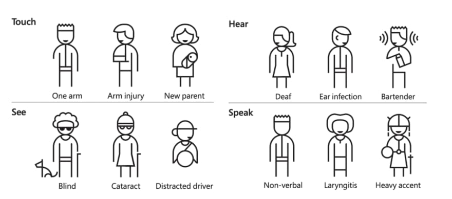

# Frontend in 2023

Ruben Oostinga

Tech Crash Course 2022-01-09

---

# Introduction

<!--
- Originally backend dev

-->

---

# What is your frontend experience?
## What questions do you have today?


---

# [Frontend roadmap](https://roadmap.sh/frontend/)


---

# The DOM
- Tree-like data structure
- Automatically created when HTML, CSS and JS is loaded 
- Can be accessed using JavaScript
- Mutable API
- Mutations can result in slow calculation for layout / painting

---

# DOM Selectors
```js
document.getElementById('myElement')
document.querySelector('#myElement')
document.getElementsByClassName('.bold')
```

---

# Updating the DOM
```js
const h1 = document.createElement('h1')
const text = document.createTextNode('hello world')
h1.appendChild(text)
document.body.appendChild(h1)
// or faster:
document.body.innerHTML += '<h1>hello world</h1>';
```

---

# Navigating the DOM

```js
const myElement = document.getElementById('myElement')

myElement.parentNode
myElement.children
myElement.nextSibling
myElement.previousSibling
```

---

# Updating Elements
```js
const h1 = document.createElement('h1');

h1.setAttribute('id', 'myHeader');
h1.removeAttribute('id');

h1.addEventListener('click', () => {
  alert('header clicked!')
});
```

---
layout: full
---

# CSS Styling


---

# CSS Properties:
```css
.button {
  color: white;
  margin: 10px;
  margin-left: 10px;
  padding: 10px 5px 7px 3px;
  background-color: grey;
  border: 1px solid black;
  border-width: 1px;
  border-style: solid;
  border-color: darkgrey;
}
```

<!--
- some properties can have multiple values
- trouble: top right bottom left
- every property with multivalue can be multiple single value properties
-->

---

# CSS Box model


<!--
- padding is inside the box
- background color spans padding box
- text or other boxes can fit in content box
-->

---

# What is layout

---

# CSS layout techniques

- Tables (only in email templates)
- Column
- Flexbox
- Grid 

---

# Issues with CSS
- Selectors are global
- Selectors cascade
- Elements often need many selectors
- Dependency between html and css is opaque
- Dead code elimination


<!--
- CSS was developed for styling documents
- Todays web apps consist of components
- Global selectors:
  - careful to avoid name collisions
  - can't have selectors like red, button
- Cascading:
  - Select elements in sub components
- CSS is separate from components
- Might include styling for unused components
-->

---

# What color is your input text?

```html
<input id="myElement" class="myClass" >
```
```css
#myElement input.myClass {
  color: red;
} /* 1-1-1 */
input[type="password"]:required {
  color: blue;
} /* 0-2-1 */
html body main input {
  color: green;
} /* 0-0-4 */
```

---
layout: full
---


---

# Solution: just use a single classname
``` css
/* components/submit-button.css */
.button { /* all styles for Normal */ }
.button--disabled { /* overrides for Disabled */ }
.button--error { /* overrides for Error */ }
.button--in-progress { /* overrides for In Progress */
```
``` html
<button class="button button--in-progress">Processing...</button>
```

<!--
- Only class selectors solves the issue of cascading style
- Use naming schemes like BEM
- Naming schemes solve naming conflicts
- Not solved:
  - Dependencies
  - Dead code elimination
-->

---

# CSS modules
- Import CSS in javascript
- Class names have local scope
- Compose styles


<!--
- Similar to JS modules, no more globals
- Import CSS in JS:
  - Only include used css
  - Make CSS part of bundle splitting
- Works in all browsers:
- Not actually local scope, but emulation
- Example of composition similar to SASS extends
-->

---

# CSS modules example
``` css
/* components/submit-button.css */
.normal { /* all styles for Normal */ }
.disabled { /* all styles for Disabled */ }
.error { /* all styles for Error */ }
.inProgress { /* all styles for In Progress */
```
``` javascript
/* components/submit-button.js */
import styles from './submit-button.css';

buttonElem.innerHTML = `<button class=${styles.normal}>
    Submit
</button>`;
```

``` html
<!-- resulting DOM -->
<button class="components_submit_button__normal__abc5436">
  Processing...
</button>
```

<!--
- import styles -> style object containing class name
- Why are these local style?
  - You can only get the name by importing the style
- Name mangling:
  - Make a hash of the contents of the style in the class name
  - Currently looks like BEM, but could be random
- Explicit dependency between JS and CSS
- CSS is part of the component
-->

---

# Tailwind


---

# What aspects to think about on the frontend
- Components
- Design / Styling
- State management
- Accessibility
- Performance
- Usability
- Type checking 
- Browser / unit testing

<!--
- Performance: speed of light
- States lives longer on frontend
- CSS approaches
-->

---

# Rendering on the server or the client


From: [www.patterns.dev](https://www.patterns.dev)

---

# Accessiblity
- Design with high contrast
- Use `alt` text for images
- Links with more meaningful text than `Click Here`
- Using the right HTML component
  -  `<button>` vs `<div>`
  -  `<h1>` vs `<span>`
  -  `<label>` vs `<span>`
  -  Use `<header>`, `<nav>`, `<main>`, `<footer>` tags
- Design for mouse / touch / keyboard usage 
  - Focus / hover styles 

<!--
- Some designers like shades of gray, low contrast
-->


---

# Accessiblity



<!--

- Keyboard is faster
- I use text 2 speech often
- Sometimes bright light

-->

---

# Components

---

# Island Architecture

---

# On the Edge

<video controls>
  <source src="edge-rendering.webm" type="video/mp4">
</video>

---

# Transitional web apps

---

# Progressive web apps

---

# JAMSTack


---

# Typescript

---

# Exercises

- [CSS Diner](https://flukeout.github.io/) first 15 challenges
- [Flexbox Froggy](https://flexboxfroggy.com/) first 10 challenges
