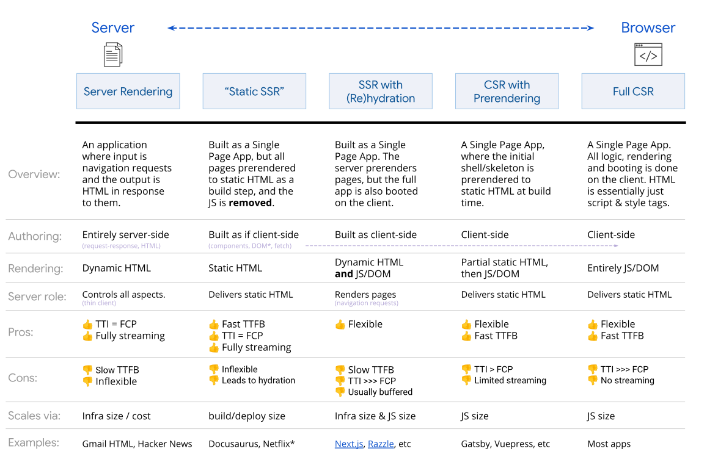

# Frontend in 2023

Ruben Oostinga / Bart den Hollander

Tech Crash Course 2022-01-09

---

# What aspects to think about on the frontend
- Components
- Design / Styling
- State management
- Accessibility
- Performance
- Usability
- Type checking 
- Browser / unit testing

<!--
- Performance: speed of light
- States lives longer on frontend
- CSS approaches
-->

---

# Rendering on the server or the client

From: [www.patterns.dev](https://www.patterns.dev)

---

# Accessiblity
- Design with high contrast
- Use `alt` text for images
- Links with more meaningful text than `Click Here`
- Using the right HTML component
  -  `<button>` vs `
`
  -  `<h1>` vs ``
  -  `<label>` vs ``
  -  Use `<header>`, `<nav>`, `<main>`, `<footer>` tags
- Design for mouse / touch / keyboard usage 
  - Focus / hover styles 

<!--
- Some designers like shades of gray, low contrast
-->

---

# Accessiblity

<!--

- Keyboard is faster
- I use text 2 speech often
- Sometimes bright light

-->

---

# Components

---

# Island Architecture

---

# On the Edge

<video controls>
  <source src="edge-rendering.webm" type="video/mp4">
</video>

---

# Transitional web apps

---

# Progressive web apps

---

# JAMSTack

---
